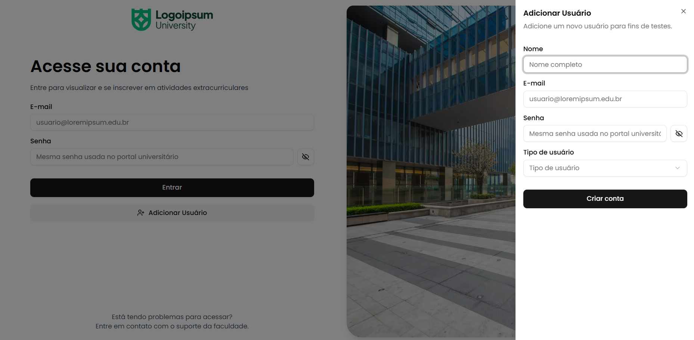

# Sistema de Inscrição em Atividades Extracurriculares

<!-- Descrição -->

## 🎯 Objetivos do Projeto

Este projeto é uma aplicação web para facilitar a **gestão e inscrição em atividades extracurriculares** no ambiente acadêmico. Ele permite que alunos explorem e se inscrevam em atividades oferecidas pela instituição, e que professores acompanhem e gerenciem essas atividades de forma prática e centralizada.

- 👨‍🎓 **Alunos:**
  - Realizar login com credenciais institucionais.
  - Explorar as atividades disponíveis.
  - Inscrever-se em atividades.
  - Visualizar e cancelar suas inscrições.
  - Visualizar e baixar certificados de atividades concluídas.
- 👨‍🏫 **Professores:**
  - Realizar login com credenciais institucionais.
  - Gerenciar atividades extracurriculares.
  - Visualizar e gerenciar inscrições dos alunos.
  - Emitir certificados para alunos que concluíram as atividades.

<!-- Tecnologias Utilizadas -->

## 🛠️ Tecnologias Utilizadas

<div style="display: flex; flex-direction: row; gap: 8px; flex-wrap: wrap; padding-bottom: 12px;">
  <!-- Typescript -->
  
  <!-- React -->
  
  <!-- Next.js -->
  
  <!-- Node.js -->
  
  <!-- pnpm -->
  
  <!-- Tailwind CSS -->
  
  <!-- Shadcn -->
  
  <!-- Lucide Icons -->
  
  <!-- PostgreSQL -->
  
  <!-- Drizzle ORM -->
  
  <!-- React Hook Form -->
  
  <!-- Zod  -->
  
  <!-- Vercel -->
  
</div>

---

<!-- Instruções -->

# 🚀 Como Executar o Projeto

## 🔧 Requisitos

- [Node.js](https://nodejs.org)
- [pnpm](https://pnpm.io)
- [Visual Studio Code](https://code.visualstudio.com) (optional, mas recomendado)

## Clonar repositório e instalar dependências

**1. Clone o repositório:**

```bash
git clone https://github.com/alexandreraminelli/sistema-de-inscricao-em-atividades-extracurriculares.git
```

**2. Abra a pasta do projeto:**

```bash
cd sistema-de-inscricao-em-atividades-extracurriculares
```

Recomendação: abra o projeto no VS Code:

```bash
code .
```

**3. Instale as dependências:**

```bash
pnpm install
```

## ⚙️ Configurar variáveis de ambiente

**4. Copie o arquivo `.env.example` para `.env.local`:**

```bash
cp .env.example .env.local
```

```env
# Modelo de variáveis de ambiente

# Banco de Dados
DATABASE_URL=
# NextAuth
AUTH_SECRET=
NEXTAUTH_URL=
```

### 🗃️ Conexão com banco de dados

**4.1. Crie um banco de dados PostgreSQL localmente ou em algum provedor online.**

> Recomendação: [Neon](https://neon.tech) ou [Supabase](https://supabase.com)

**4.2. Insira na variável `DATABASE_URL` a URL de conexão do banco de dados.**

### 🔐 Configuração do NextAuth

**4.3. Execute o seguinte comando para gerar um segredo do [NextAuth](https://next-auth.js.org) para a variável `AUTH_SECRET`:**

```bash
npx auth secret
```

**4.4. Insira em `NEXTAUTH_URL` a URL onde você executará o projeto. Se estiver rodando localmente, use `http://localhost:` seguido pela porta usada (padrão `3000):**

```env
NEXTAUTH_URL=http://localhost:3000
```

> ⚠️ Caso deseje rodar o projeto em produção, substitua `NEXTAUTH_URL` pela URL do seu domínio.

## 🗃️ Configurar Banco de Dados

**5. Execute as migrações do banco de dados usando o [Drizzle ORM](https://orm.drizzle.team):**

```bash
pnpm db:migrate
```

### Realizar atualizações no banco de dados

Para realizar atualizações no banco de dados após editar os arquivos de schema (na pasta `src/database/schema`), execute as etapas abaixo:

1. Crie um novo arquivo de migração:

```bash
pnpm db:generate
```

2. Execute a migração:

```bash
pnpm db:migrate
```

### Executar [Drizzle Studio](https://orm.drizzle.team/drizzle-studio/overview)

Para executar o Drizzle Studio, que permite visualizar e interagir com o banco de dados e suas tabelas usando uma interface gráfica intuitiva, execute o seguinte comando:

```bash
pnpm db:studio
```

O Drizzle Studio será iniciado e você poderá acessá-lo no seu browser em `https://local.drizzle.team`.

> ⚠️ Em browsers com recursos de segurança (como Safari e Brave), pode ser necessário desabilitar as proteções para esse domínio.

## 🚀 Executar o Projeto

Para executar o projeto, você pode escolher entre dois modos: **desenvolvimento** ou **produção**.

### 🧑‍💻 Executar em desenvolvimento

```bash
pnpm dev
```

### 📦 Executar em produção

```bash
pnpm build && pnpm start
```

Em ambos os casos, o projeto estará acessível em `http://localhost:3000` (ou outra porta se `3000` estiver sendo usada por outro programa).

## 🔐 Adicionar usuários

Ao executar o projeto em **modo de desenvolvimento**, será exibido na tela de login um botão que abre o formulário para adicionar usuários.


